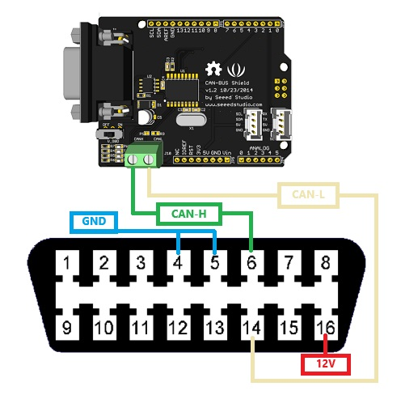

# Arduino ECU Simulator

A simulated Engine Control Unit (ECU) for Arduino using a CAN Bus shield to mimic responses to OBD-II commands.

## Features

- **Simulate OBD-II Commands**: Respond to PIDs (Parameter IDs) commonly used in automotive diagnostics.
- **CAN Bus Communication**: Utilize the Arduino CAN Bus shield to communicate like a real ECU.
- **Customizable Responses**: Easily tweak the code to mimic different engine conditions or faults.
- **Educational Tool**: Great for learning OBD-II protocols or testing diagnostic tools.

OBD-II (On-Board Diagnostics II) allows for standardized diagnostics of automotive systems. This simulator aims to replicate those diagnostics for educational or development purposes.

## Supported Commands

-  MODE 1 Used for "live" sensor data, most relevant are provided but adding new ones is straight forward.
- MODE 2  Used for Freeze Frames of when an error code is detected. Not implemented.
- MODE 3 Used for Error Codes.
- MODE 9 Used for Vehicle data (VIN, calibration id, etc).

## Usage

- **Arduino + Arduino IDE**
- **CAN Bus Shield v2**
- **OBD Female connector**
- **12V power source**

1. **Hardware Setup**:
   - Connect your Arduino to the CAN Bus shield.
   - 12v only required for powering scanning device.
   
   

2. **Software**:

   - Open in Arduino IDE
   - Install Seeduino Can Bus library
   - SPI Pin for CAN Bus Shield is pin 9, other versions use pin 10.
